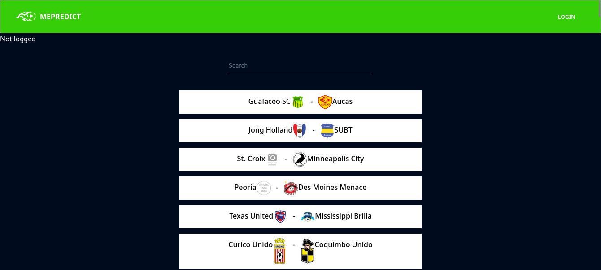

# MePredict

## Table of Content

- [Description](#description)
- [Screenshot](#screenshot)
- [Installation](#install-requirements)
- [Technology Used](#technology)
- [License](#license)
- [Authors Info](#authors-Info)

## Description

This web app gives football fans a platform to share their football predictions.

## Screenshot

# 

## Install Requirements

- Computer

- Internet Access

- Git

- Terminal

- Npm

## Installation

On your computer open terminal and run:

    $ git clone https://github.com/qurriahSam/mePredict.git

    $ cd mePredict

    $ npm install

    $ npm start

[Go Back to the top](#MePredict)

## Technology

- Semantic HTML5 Markup - Has been used to build the structure of the page.

- CSS Custom properties - Has been used to style the landing page.

- JavaScript - Has been used to create the business logic.

- Tailwind CSS - Has been used for styling the navbar and other elements on the landingpage.

- ReactJS - Has een used to create components of the web app

## Links

- Live Site URL: [MePredict](https://mepredict.vercel.app/)

[Go Back to the top](#MePredict)

## License

[MIT](./LICENSE) License.

[Go Back to the top](#MePredict)

## Authors Info

Linked - [Sam Kuria](https://www.linkedin.com/in/sam-kuria-0904b01a1)

[Go Back to the top](#MePredict)
